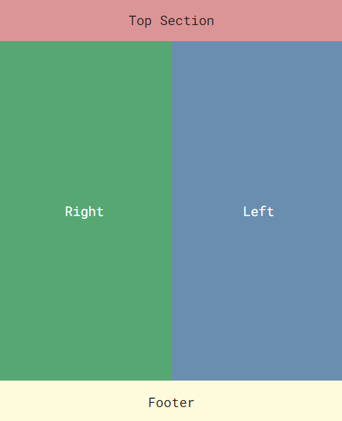

# Highly Reusable Page Layout using React Design Patterns

Fully responsive fluid page layout build with React Design Pattern: Split Screen.

---

## This project uses

- 🧪 React + Vite.
- ✨ Styles-Components.

## Run

### `npm install` or `yarn` depending on the command-line tool you are using

## Local View

### `npm run dev` or `yarn dev` depending on the command-line tool you are using

---

### License

Copyright © 2015 @frnt-end
[frnt-end.github.io/portfolio/](https://frnt-end.github.io/portfolio/)

